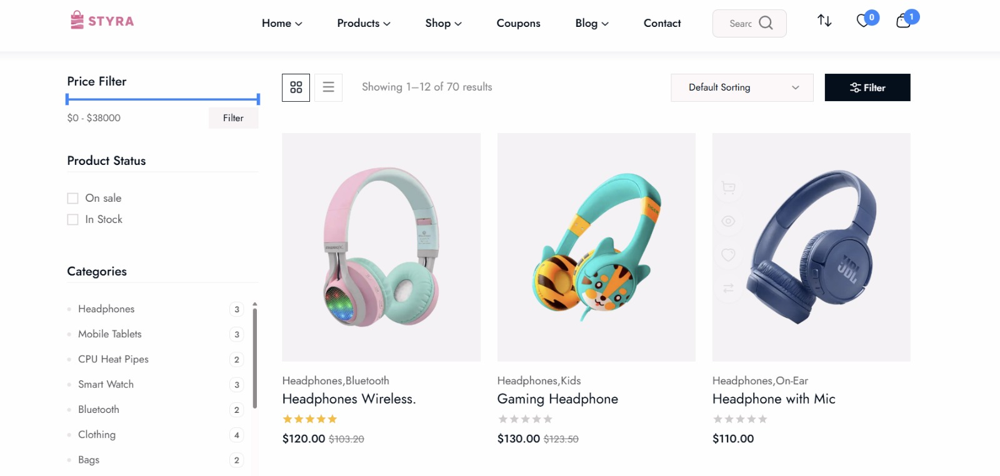

<p align="center">
  
</p>

# Styra — Production Ready Full Stack eCommerce Platform
Styra is a full‑stack eCommerce application built with Next.js, Express.js, MongoDB, and Redux Toolkit.

It includes a feature‑rich admin dashboard, Stripe payment integration, and a scalable architecture designed using real‑world production practices for managing products, users, and orders efficiently.
## Live Demo

[](https://styra-tau.vercel.app)


## Project Screenshots
<p align="center">
  
</p>

<p align="center">
  
</p>

---

## Features Overview

- **Next.js:** A production-ready React framework that ensures high performance, SEO optimization, and scalability.
- **Express.js:** A minimal and flexible Node.js backend framework used to build robust REST APIs.
- **MongoDB:** A scalable NoSQL database for efficient data storage and retrieval.
- **Mongoose:** Schema-based data modeling with validation, middleware, and query building.
- **Stripe:** Secure and reliable payment gateway integration for online transactions.
- **Nodemailer:** Email service integration for notifications and authentication workflows.
- **Authentication System:** Secure JWT-based authentication including registration, login, password reset, and protected routes.
- **Redux Toolkit:** Modern and efficient global state management.
- **RTK Query:** Optimized data fetching, caching, and API handling.
- **Form Validation:** Ensures accurate and validated user input across the application.
- **Responsive Layout Design:** Fully responsive across desktop, tablet, and mobile devices.
- **Admin Dashboard:** Complete management of products, users, and orders from a centralized panel.

---

## Full Features List

- **React JS:** Dynamic and interactive user interface development.
- **Next.js App Structure:** Optimized routing and performance handling.
- **Express REST API:** Clean and scalable backend architecture.
- **MongoDB Database Integration**
- **Mongoose Data Modeling**
- **Stripe Payment Processing**
- **JWT Authentication**
- **Protected API Routes**
- **Redux Toolkit State Management**
- **RTK Query Data Layer**
- **Dynamic Routing**
- **Product Filtering & Search**
- **Shopping Cart System**
- **Order Management System**
- **Admin Product Management**
- **Admin User Management**
- **Secure Middleware Implementation**
- **Environment-based Configuration**
- **Clean and Modular Codebase**
- **Responsive UI Design**
- **Production-ready Folder Structure**

---

## Powerful Additional Features

- **Complete E-commerce Workflow:** From product listing to secure checkout.
- **Cart & Checkout System:** Smooth and optimized ordering experience.
- **Order History Tracking:** Users can track their previous purchases.
- **Role-Based Access Control:** Separate permissions for admin and users.
- **Secure Payment Integration using Stripe**
- **Scalable Backend Services Structure**
- **Reusable and Customizable Components**
- **Optimized API Communication between Frontend and Backend**
- **Error Handling & Validation Middleware**
- **Clean Code & Maintainable Architecture**

---

## Installation and Usage

To get started with Styra, follow these steps:

### 1. Clone the repository

```bash
git clone https://github.com/rohit-gotgit/styra.git
cd styra
```

---

### 2. Setup Backend

```bash
cd styra-backend
npm install
```

Create a `.env` file and configure:

```
PORT=
MONGO_URI=
JWT_SECRET=
STRIPE_SECRET_KEY=
EMAIL_USER=
EMAIL_PASS=
```

Run backend:

```bash
npm run dev
```

---

### 3. Setup Frontend

```bash
cd ../styra-frontend
npm install
npm run dev
```

---

## Project Structure

```
Styra
├── styra-frontend   # Next.js Client Application
└── styra-backend    # Express API Server
```

Frontend communicates with backend using secure REST APIs.

---

## Developer

Rohit Kumar  
Full Stack Developer  
Focused on building scalable and production-ready web applications using modern MERN stack technologies.

---

## License

This project is developed for learning, portfolio, and production practice purposes.
